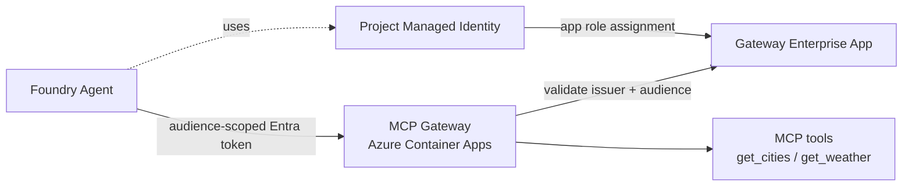
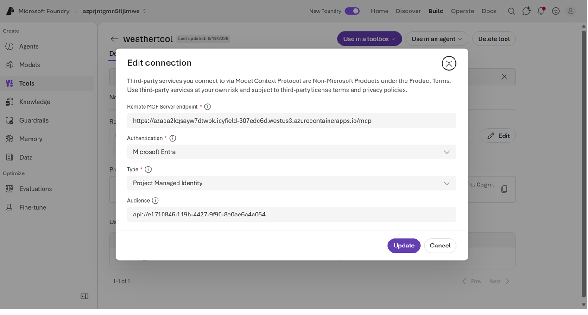
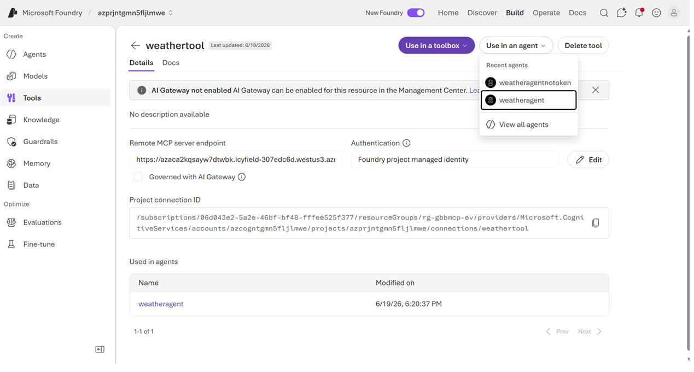
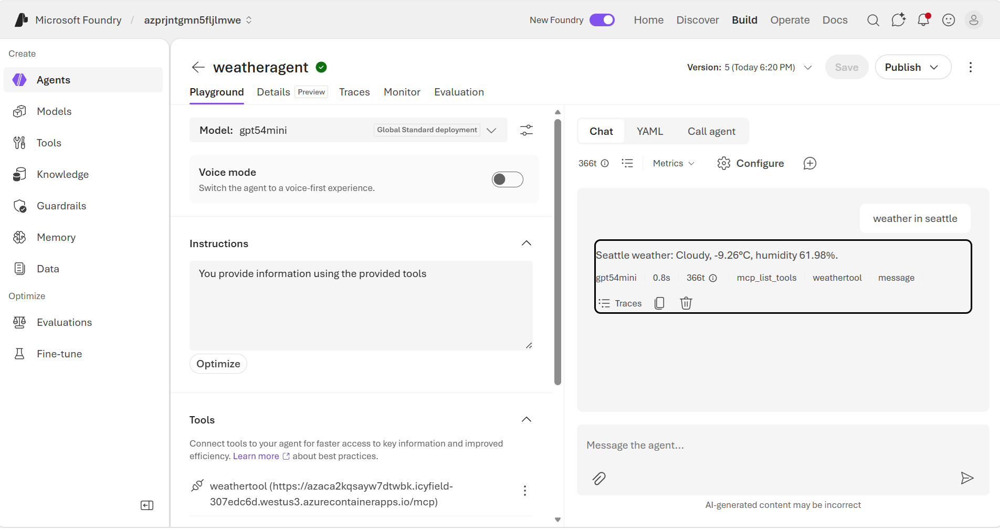

#  Foundry → Entra-Protected FastMCP Gateway

Deploy a custom [Model Context Protocol (MCP)](https://modelcontextprotocol.io/) gateway to Azure Container Apps and secure it with Microsoft Entra ID, so Azure AI Foundry agents can call it using audience-scoped tokens from their project managed identity.

## Contents

- [Architecture](#architecture)
- [How it works](#how-it-works)
- [MCP tools](#mcp-tools)
- [Repo layout](#repo-layout)
- [Prerequisites](#prerequisites)
- [Environment variables](#environment-variables)
- [Deployment flow](#deployment-flow)
- [Endpoints](#endpoints)
- [Verify in the Foundry UI](#verify-in-the-foundry-ui)
- [Troubleshooting](#troubleshooting)

## Architecture



1. Azure AI Foundry account and project are provisioned by Bicep.
2. A custom MCP server (Python FastMCP) runs in Azure Container Apps.
3. Gateway endpoints require a valid Entra bearer token.
4. The Foundry project managed identity is granted an app role on the gateway enterprise app.
5. The Foundry MCP connection calls the gateway endpoint with audience-scoped tokens.

## How it works

- **MCP server:** Python FastMCP in [`gateway/src/server.py`](gateway/src/server.py)
- **MCP transport path:** `/mcp` (SSE transport)
- **Health path:** `/healthz` (unauthenticated)
- **Auth checks** (enforced by `EntraAuthMiddleware`):
  - Issuer matches the configured tenant (`https://login.microsoftonline.com/<tenant>/v2.0`)
  - Audience matches `GATEWAY_AUDIENCE` (plus safe compatibility variants and `EXTRA_ACCEPTED_AUDIENCES`)
  - Optional caller allow-list via `ALLOWED_CLIENT_IDS` (matched against the token `azp`/`appid` claim)

## MCP tools

The FastMCP server exposes two sample tools (returning mock data):

1. `get_cities(country)` — list cities for a country.
2. `get_weather(city)` — return mock weather for a city.

## Repo layout

| Path | Description |
| --- | --- |
| [`infra/main.bicep`](infra/main.bicep) | Azure resources (ACA, ACR, Log Analytics, Foundry account/project/model deployment). |
| [`infra/main.parameters.json`](infra/main.parameters.json) | azd parameter mapping. |
| [`azure.yaml`](azure.yaml) | azd service + infra config. |
| [`gateway/Dockerfile`](gateway/Dockerfile) | Container build (Python). |
| [`gateway/requirements.txt`](gateway/requirements.txt) | Python dependencies. |
| [`gateway/src/server.py`](gateway/src/server.py) | FastMCP server + Entra middleware. |
| [`scripts/00-set-env.example.sh`](scripts/00-set-env.example.sh) | Environment template. |
| [`scripts/01-create-entra-app.sh`](scripts/01-create-entra-app.sh) | Create/update gateway app registration and service principal. |
| [`scripts/02-assign-foundry-mi-app-role.sh`](scripts/02-assign-foundry-mi-app-role.sh) | Assign app role to the Foundry project managed identity. |

## Prerequisites

1. **Azure CLI** logged in to the target subscription (`az login`).
2. **Azure Developer CLI** (`azd`).
3. **Docker** running locally (for the container build).
4. **Bash** (Linux, macOS, or Git Bash on Windows) and **Python 3** (used by the scripts to generate UUIDs).
5. Permission to manage Entra **app registrations** and **app role assignments** in the tenant.

## Environment variables

Copy [`scripts/00-set-env.example.sh`](scripts/00-set-env.example.sh) to `.env.sh` and fill in real values.

| Variable | Set by | Purpose |
| --- | --- | --- |
| `AZ_SUBSCRIPTION_ID` | you | Target subscription. |
| `AZ_LOCATION` | you | Azure region. |
| `AZ_RESOURCE_GROUP` | you | Resource group name. |
| `NAME_PREFIX` | you | Prefix for resource names. |
| `ENTRA_TENANT_ID` | you | Tenant used for token validation. |
| `GATEWAY_APP_DISPLAY_NAME` | you | Display name of the gateway app registration. |
| `GATEWAY_REQUIRED_APP_ROLE` | you | App role enforced for callers (e.g. `Mcp.AppInvoke`). |
| `FOUNDRY_PROJECT_RESOURCE_ID` | you | Foundry project resource ID granted the app role. |
| `ALLOWED_CLIENT_IDS` | you (optional) | Comma-separated caller allow-list. |
| `GATEWAY_APP_ID` | script 01 output | Gateway app (client) ID. |
| `GATEWAY_APP_ID_URI` | script 01 output | Gateway Application ID URI (`api://<app-id-guid>`). |

> **Note:** `GATEWAY_APP_ID` and `GATEWAY_APP_ID_URI` are produced by script 01. Export them (and run the `azd env set` commands below) before running script 02 and `azd up`.

## Deployment flow

### 1) Prepare environment

```bash
cp scripts/00-set-env.example.sh .env.sh
# edit .env.sh with real values
source .env.sh
```

### 2) Create/update the gateway Entra app

```bash
bash scripts/01-create-entra-app.sh
```

Add the printed values to your `.env.sh` so later steps pick them up:

```bash
# in .env.sh
export GATEWAY_APP_ID="<app-id-guid>"
export GATEWAY_APP_ID_URI="api://<app-id-guid>"
```

Also set `FOUNDRY_PROJECT_RESOURCE_ID` in `.env.sh` (used by script 02):

```bash
# in .env.sh
export FOUNDRY_PROJECT_RESOURCE_ID="/subscriptions/<sub>/resourceGroups/<rg>/providers/Microsoft.CognitiveServices/accounts/<account>/projects/<project>"
```

Then re-source it and mirror the gateway values into the azd environment:

```bash
source .env.sh
azd env set GATEWAY_APP_ID "$GATEWAY_APP_ID"
azd env set GATEWAY_APP_ID_URI "$GATEWAY_APP_ID_URI"
```

### 3) Deploy infrastructure and gateway

```bash
azd up
```

### 4) Assign the Foundry project MI to the gateway app role

```bash
source .env.sh
bash scripts/02-assign-foundry-mi-app-role.sh
```

## Endpoints

After deployment, get the URL from the azd environment:

```bash
azd env get-values | grep CONTAINER_APP_URL
```

Then use:

- **MCP endpoint:** `<CONTAINER_APP_URL>/mcp`
- **Health endpoint:** `<CONTAINER_APP_URL>/healthz`

## Verify in the Foundry UI

### 1) Create or edit the MCP tool connection

In Foundry, go to **Tools** and create (or edit) a remote MCP tool with:

1. Remote MCP server endpoint: `https://<your-container-app-fqdn>/mcp`
2. Authentication: `Microsoft Entra`
3. Type: `Project Managed Identity`
4. Audience: `api://<gateway-app-id>`

**Expected result:**

1. The tool connection saves successfully.
2. Foundry can enumerate tools from the endpoint.



### 2) Use the tool in an agent

1. Open the tool page and select **Use in an agent**.
2. Choose an existing agent (or create one).
3. Confirm the tool appears in the agent tool list.

**Expected result:**

1. The tool is listed under agent tools.
2. No auth or endpoint errors in the tool panel.



### 3) Call the agent in the Playground

In the agent Playground, send a prompt that triggers the tool, for example:

1. `weather in seattle`
2. `get weather for lisbon`

**Expected result:**

1. The trace shows tool invocation (for example `mcp_list_tools` and the weather tool call).
2. The agent response returns weather data from the MCP server.



## Troubleshooting

| Symptom | Fix |
| --- | --- |
| `401 unexpected aud claim value` | Ensure the Foundry connection audience equals `GATEWAY_APP_ID_URI`. |
| `Missing required env var: GATEWAY_APP_ID` (script 02 exits 1) | Export `GATEWAY_APP_ID` from script 01 output before running script 02. |
| `resource tagged with azd-service-name not found` | Run `azd provision`, then `azd deploy`, to update tags. |
| Soft-deleted resource blocks deployment | Purge the soft-deleted resource (for example, the Foundry account) and rerun `azd up`. |
| MCP enumeration timeout or 404 | Confirm the latest image is active on the Container App, re-run `azd deploy`, and verify the endpoint path is `/mcp`. |
